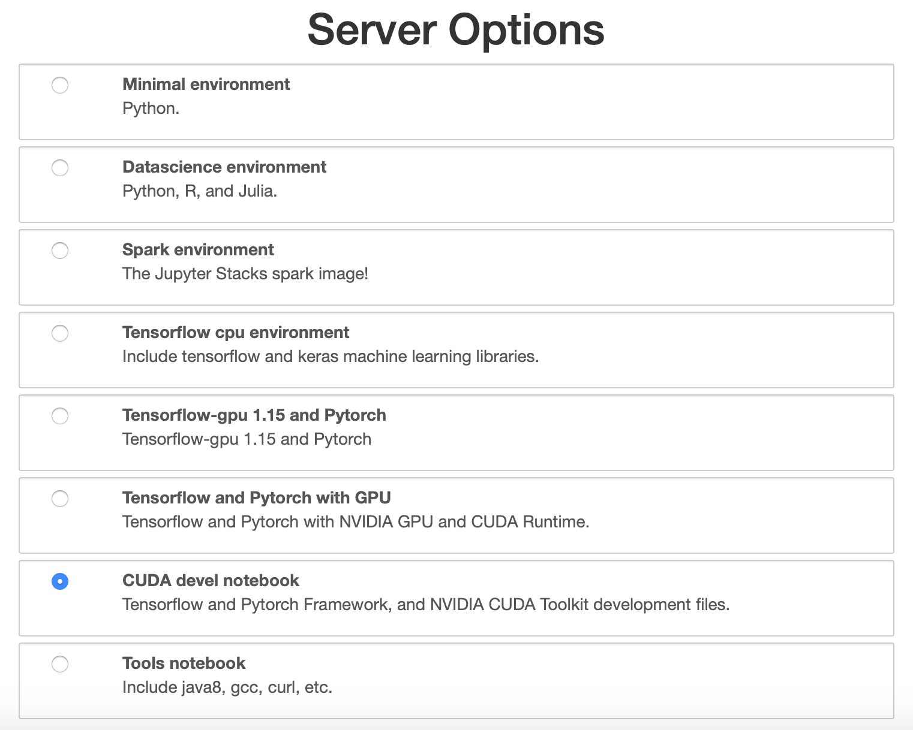
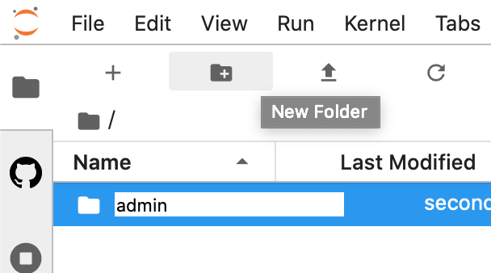
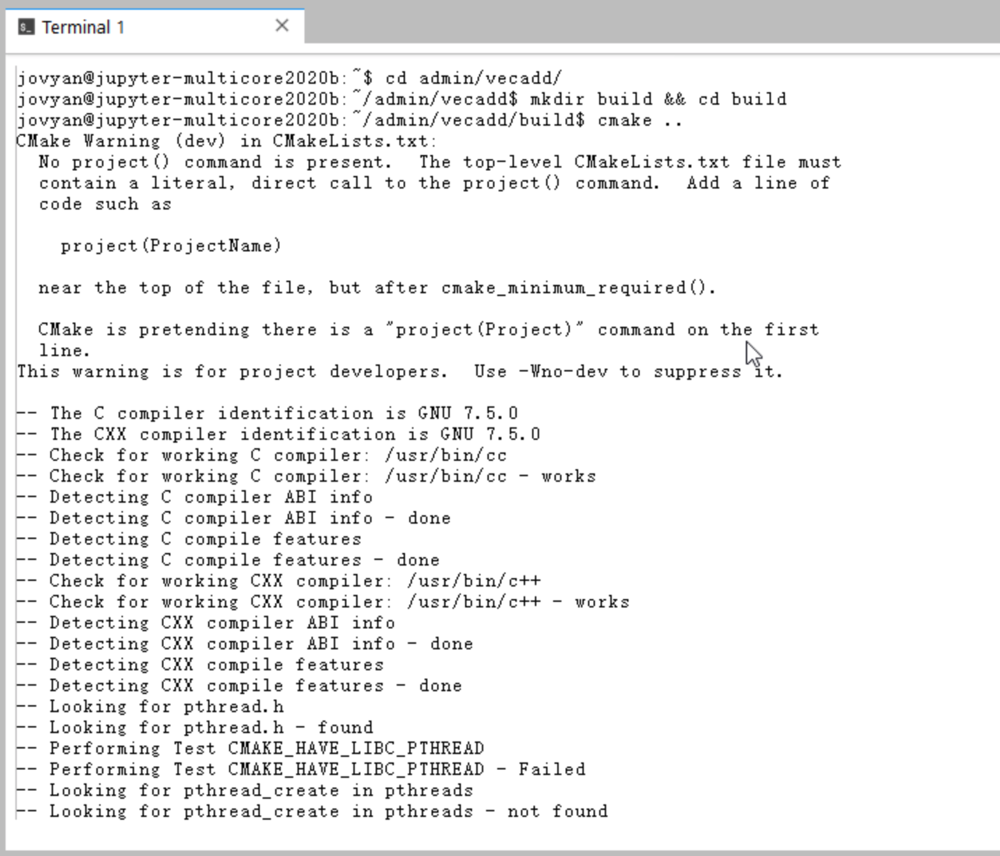
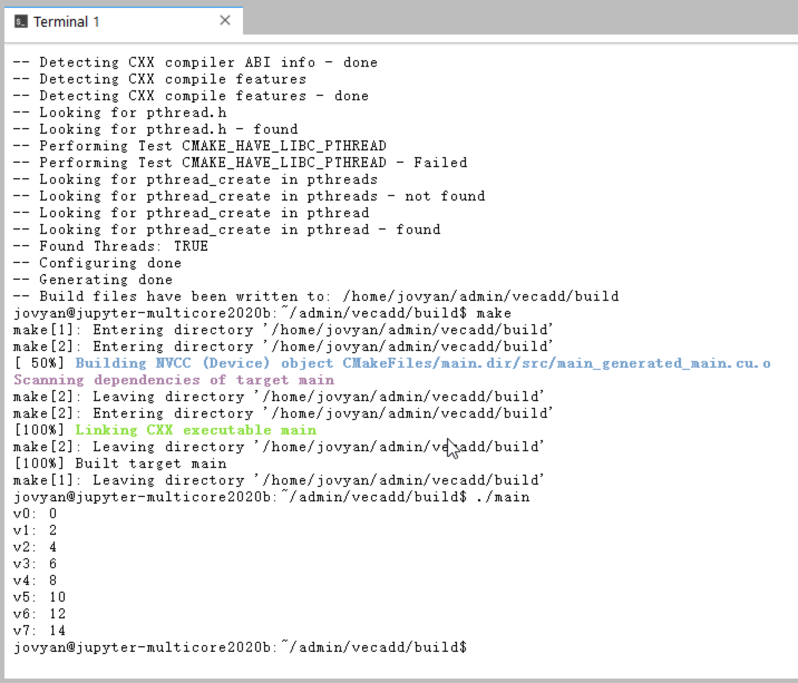

# A Brief Guide to the Usage of the JupyterHub Platform

First log in to http://jupyterhub.vickytse.cn/ (remember that you might have to set-up the VPN connection first).

## Step 0.1

If you encounter the `Server Options` page, select `CUDA devel notebook` and continue.



## Step 0.2

If you are using the shared account, create a folder for yourself first (you are free to use any folder names you like).



## Step 1

Open a new `Launcher` tab, and select the `Terminal` option on the `Launcher` page.


## Step 2

Then you can use the pre-installed CUDA toolkit through the `Terminal`.


Example commands include:

```bash
# To show CUDA devices' statuses
nvidia-smi

# To show the nvcc version
nvcc --version
```

## Step 3

If you want to hand on a real CUDA program, you can refer to the example `vecadd` [project](https://github.com/lukeluocn/multicoresysu2020/tree/master/content/rexec/vecadd).

You are suggested to copy/upload the files manually instead of cloning the whole repo directly (the repo contains the slides as well and some of them are huge).

Then you can `cd` into the `vecadd` project, and follow the commands below to compile and run the vector add program:

```bash
# cd /path/to/the/vecadd/project
mkdir build && cd build
cmake ..
make
./main
```


